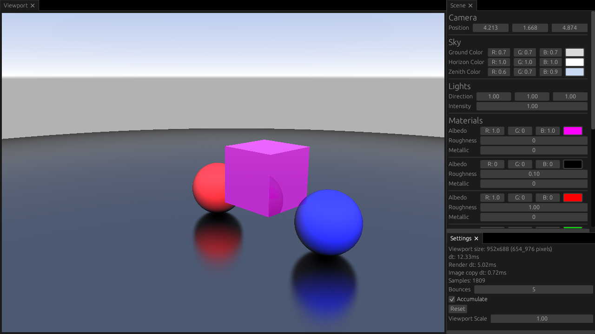

# bevy_tracing

Simple path tracer using bevy and egui.

It is based on a few resources:

- The Cherno raytracing series: <https://www.youtube.com/playlist?list=PLlrATfBNZ98edc5GshdBtREv5asFW3yXl>
- Sebastian Lague ray tracing video: <https://www.youtube.com/watch?v=Qz0KTGYJtUk>
- Raytracing in a weekend series: <https://raytracing.github.io>
- Scratchapixel: <https://www.scratchapixel.com>
- Computer Graphics From Scratch: <https://gabrielgambetta.com/computer-graphics-from-scratch/>

Some more specific algorithms are linked directly in the code where they are used.

## Features

- Multithreading using rayon
- *very* simple shading
- Spheres
- Triangles
- Aabb test to accelerate triangle intersection testing
- Simple sky gradient
- Interactive UI to modify the scene at runtime
- Accumulate rays over time if nothing moves
- Customizable render scale
